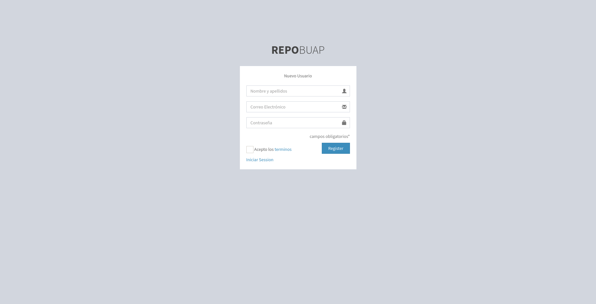
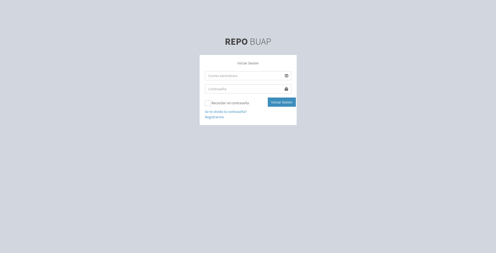
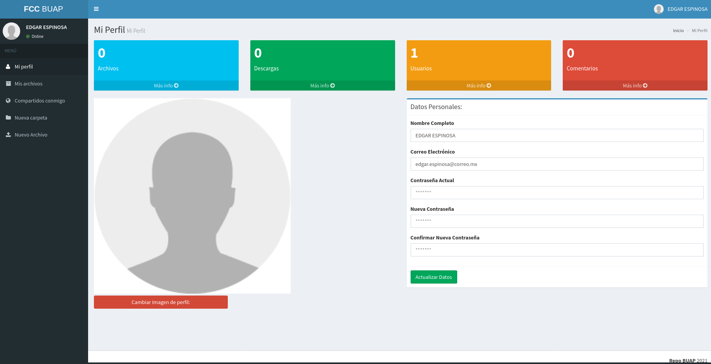
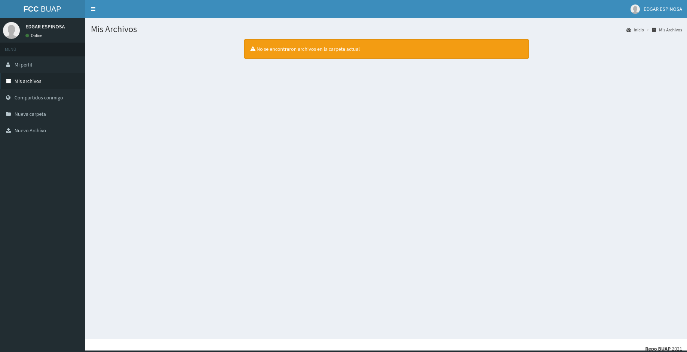
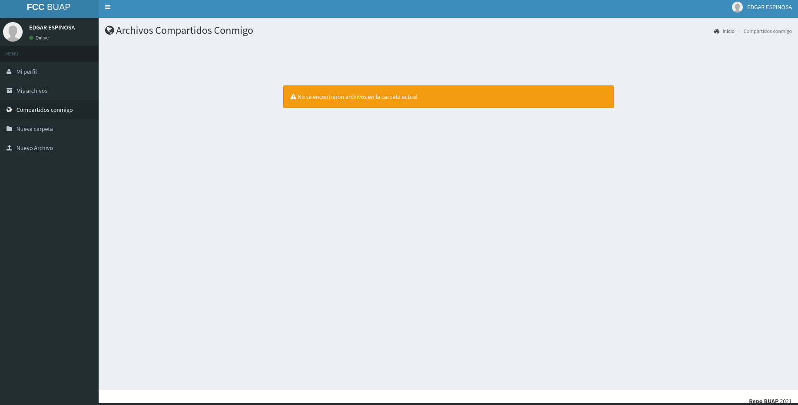
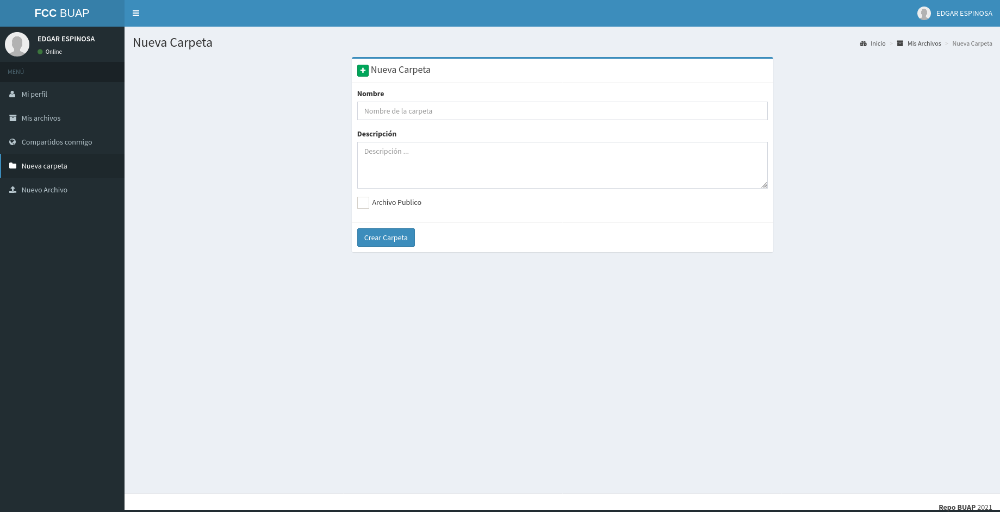
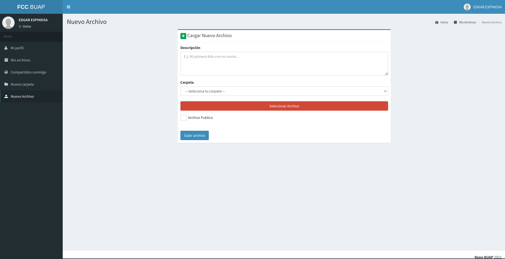
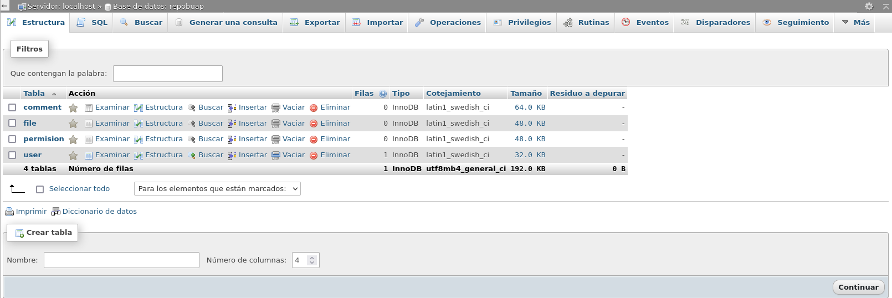

# repobuap
## Aplicación web para practicas profesionales BUAP-FCC 

El programa final fue dividido en las siguientes partes, cada una con distintos tiempos debido a que combina distintas áreas como son backend, frontend, bases de datos, configuración de servicio http.

    1. Análisis y propuesta de solución al problema
    1. Planeación para el frontend (Mockup)
    1. Desarrollo de la base de datos
    1. Desarrollo del Frontend (Interfaz de Usuario)
    1. Desarrollo del Backend(conexión a base de datos y operaciones con datos de manera interna)
    1. Desarrollo de Manual para el uso de la aplicación “REPO BUAP”

## La idea principal es que dicha plataforma sea un soporte para el seguimiento de una tesis por parte de los asesores, de tal manera, que estos, puedan revisar, aceptar o pedir que se vuelva a elaborar cada punto del protocolo de tesis. En particular, en la Facultad de Ciencias de la Computación, se tiene un protocolo de tesis agrupado en dos partes: 1) Datos del estudiante y tesis; 2) Descripción del proyecto. Así como permitirá definir los puntos de la tesis y dar un seguimiento de que estos se elaboren de manera adecuada. El aporte principal de este trabajo, es precisamente la colaboración, por ello, la plataforma esta contempla para trabajar con uno o más asesores y tesistas.

